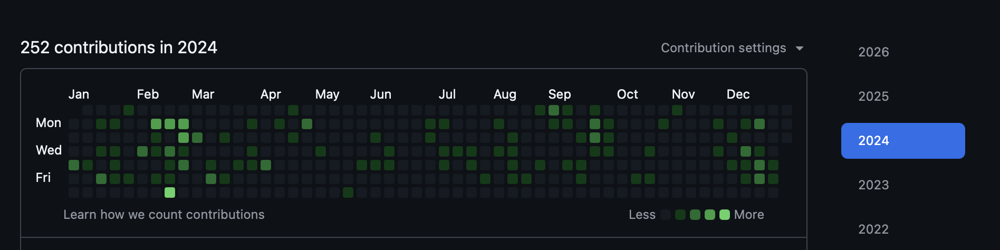
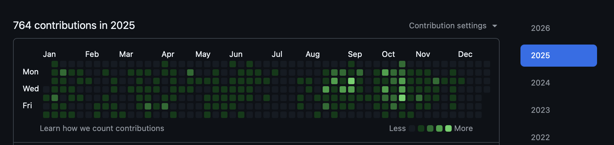

### Hi, I'm Saurabh Sarkar

Builder based in Seattle. I work on AI agents, developer tools, and data infrastructure.

[sarkar.ai](https://sarkar.ai) &#183; [LinkedIn](https://www.linkedin.com/in/saurabh-sarkar-ai/) &#183; [Google Scholar](https://scholar.google.com/citations?user=ZbDurfwAAAAJ&hl=en) &#183; [@sarkarsaurabh27](https://twitter.com/sarkarsaurabh27)

---

### Projects

**AI & Agents**

- [Agent Loop Learning](https://github.com/sarkarsaurabh27/agent-loop-learning) - A reference library and skill toolkit for auditing, reviewing, and improving LLM-based agent systems
- [Agentic Framework Study](https://github.com/sarkar-chicory/agentic-frameworks-study) — Comparative study of agentic AI frameworks
- [Chicory](https://github.com/chicoryai/chicory) — Open source AI agent platform for data teams `Python`
- [Deskmate](https://github.com/sarkar-ai-taken/deskmate) — Control your device from anywhere using natural language `TypeScript`
- [Riva](https://github.com/sarkar-ai-taken/riva) — Local-first observability and control plane for AI agents `Python`
- [Simulation Data Miner (simminer)](https://github.com/light-valley-ai/simminer) - Infrastructure for AI-native photonics workflows
- Presentation Buddy — AI-powered presentation assistant
- Agent Harness Board - A message board for resource allocation management.

**Developer Tools**

- [Azure Dev Spaces](https://github.com/Azure/dev-spaces) — Kubernetes inner-loop development tooling for Azure (succeeded by Bridge to Kubernetes) `Go`
- [Claude Code SDK](https://github.com/chicoryai/claude-code-sdk-python) — Python SDK for Claude Code `Python`
- [Developer Fatigue](https://github.com/sarkarsaurabh27/Fatigue-Tool) — Research tool for measuring developer fatigue `Java`
- [Gen AI Local Shell](https://github.com/sarkarsaurabh27/gen-shell) — Generative AI-based CLI assistant tool `Python`

**Apps & Platforms**

- [Carbonara](https://github.com/TryCarbonara/trycarbonara.github.io) — Carbon footprint measurement for cloud infrastructure `JavaScript` `TypeScript`
- [Forecast Your Trip](https://www.forecastyourtrip.co/) — Plan trips based on weather preferences &nbsp;·&nbsp; [Facebook](https://www.facebook.com/forecastyourtrip) &nbsp;·&nbsp; [GitHub](https://github.com/sarkarsaurabh27/ForecastYourTrip)
- [OneMoment](https://github.com/sarkarsaurabh27/OneMomentWebApp) — Real-time event discovery platform `JavaScript` `Go` &nbsp;·&nbsp; [Instagram](https://www.instagram.com/one.moment.live)
- [Brute Force Defense](https://play.google.com/store/apps/details?id=com.sarkar.security.bruteforcedefense&hl=en) — Security app for Android / MS Band `Android` &nbsp;·&nbsp; [GitHub](https://github.com/sarkarsaurabh27/BruteForceDefense)
- [Simulation Miner](https://github.com/light-valley-ai/simminer) - Infrastructure for AI-native photonics workflows

---

### Also me on GitHub

[chicoryai](https://github.com/chicoryai) &#183; [sarkar-chicory](https://github.com/sarkar-chicory) &#183; [sarkar-ai-taken](https://github.com/sarkar-ai-taken) &#183; [TryCarbonara](https://github.com/TryCarbonara) &#183; [Light Valley](https://github.com/light-valley-ai)

Chicory:
**[sarkar-chicory](https://github.com/sarkar-chicory)**

 

Microsoft:
**[saurabsa](https://github.com/saurabsa)**

AWS:
**[srbhsrkr](https://github.com/srbhsrkr)**

---

### Publications

See my research on [Google Scholar](https://scholar.google.com/citations?user=ZbDurfwAAAAJ&hl=en).
